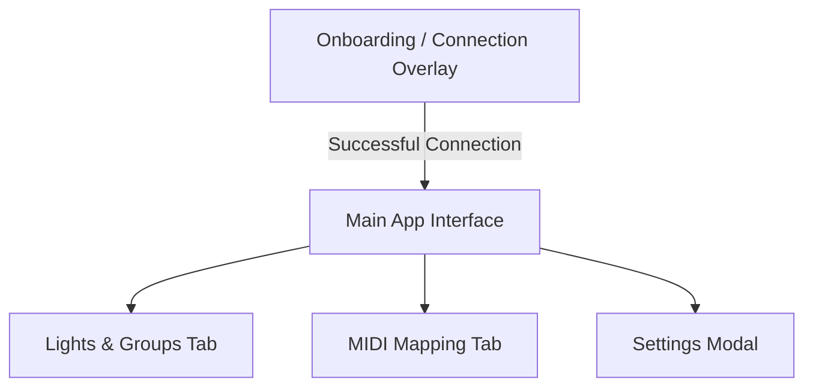

# HueMIDIty User-Level & Technical Specification

This document provides a comprehensive overview of the **HueMIDIty** utility—a Philips Hue MIDI controller utility designed to bind MIDI controller events (knobs, faders, notes) to Philips Hue lights, groups, and scenes.

---

## 1. User Flows & Connection Logic

The application features a structured connection state machine that manages communication with the Philips Hue Bridge on the local network. 

### A. Automatic Discovery Flow
1. **Initiation**: On startup, the backend checks for a saved `bridge_ip` in `config.json`.
2. **Search Phase**: If no IP is saved, the application enters the `searching` state and queries the official Hue discovery endpoint (`https://discovery.meethue.com/`).
   - *UI State*: A spinner is displayed with the message: `"Searching for Philips Hue Bridge on your local network..."`
   - *Control*: An **"Enter IP Manually"** button is provided to bypass automatic lookup.
3. **Discovery Result**:
   - If an IP is discovered, the IP is stored, and the system attempts to establish connection.
   - If discovery fails (e.g., no internet or no bridge on the subnet), the manager transitions to the `error` state.

### B. Authentication / Pairing Flow
If a bridge is found, but the application's developer key is not yet registered (first-time connection):
1. **Bridge State**: The bridge manager transitions to the `needs_link` state.
2. *UI State*: The pairing screen is displayed, prompting physical interaction:
   - *Message*: `"Authentication Required. Press the physical Link Button on your Hue Bridge now to connect."`
   - *Visuals*: Shows a pulsing graphic representing the bridge, a countdown progress bar, and displays the discovered Bridge IP address.
   - *Control*: A **"Back / Change IP"** button to abort or correct the IP address.
3. **Polling**: The background thread polls the bridge every 3 seconds. Once the physical link button is pressed, the bridge registers the app client, returns the access credentials (saved internally by the `phue` library), and the status transitions to `connected`.

### C. Manual Connection Flow
If auto-discovery fails or the user chooses to input an IP manually:
1. **Bridge State**: The application enters the `idle` state.
2. *UI State*: Manual connection form.
   - *Message*: `"Enter the IP address of your Philips Hue Bridge:"`
   - *Controls*: A text box for IP input (e.g. `192.168.1.15`), a **"Connect"** button, and an **"Auto-Discover Again"** button to restart the discovery loop.
3. **Execution**: Clicking "Connect" calls `connect_bridge(ip)`. The app transitions back to the search state and attempts pairing at that address.

### D. Connection Error Flow
If connection attempts fail (e.g. timeout, host unreachable):
1. **Bridge State**: Transitions to the `error` state.
2. *UI State*: Displays a warning symbol.
   - *Message*: `"Connection Error. Unable to connect to the Hue Bridge: [Error message details]"`
   - *Controls*: A **"Retry Auto-Discovery"** button and an **"Enter IP Manually"** button.

### E. Disconnection (Forgetting a Bridge)
1. **Initiation**: Triggered from the Settings panel using the **"Forget Hue Bridge"** option.
2. **Confirmation**: A modal asks: `"Disconnect and forget the current Hue Bridge?"`
3. **Cleanup**: Upon confirmation, the background connection loop is terminated, the active `phue.Bridge` instance is deleted, the `bridge_ip` setting in `config.json` is set to an empty string, the main app interface hides, and the onboarding overlay shows the Manual IP entry form.

---

## 2. Main Interface Controls

Once connected, the main layout is divided into two primary navigation tabs and a global settings area.



### A. Global Header Controls
- **Navigation Tabs**: Toggle buttons for **"Lights & Groups"** and **"MIDI Mapping"**.
- **Status Badge**: A green/red indicator dot showing connection status. It is clickable (`refreshDevices()`) to force-refresh light/group/scene parameters.
- **Settings Gear Button**: Opens the Application Settings modal.

### B. "Lights & Groups" Tab (Dashboard)
This panel displays a grid of widgets representing the lights and groups the user wants to monitor/control.

- **Empty State Placeholder**: Displays if no widgets have been configured. Shows: `"Your dashboard is empty. Add light and group widgets to build your custom layout."` and an **"Add Widgets"** button.
- **Floating Add Button ("+")**: Located at the bottom-right corner. Opens the Multiselect Add Widgets modal.
- **Device Card Control Widgets**:
  - **Drag Handle (`⠿`)**: Allows reordering widgets within the grid via drag-and-drop.
  - **Device Name**: Displays the name of the light or group.
  - **Toggle Switch**: A checkbox slider to turn the device ON or OFF. If the device is offline/missing, it displays `"offline"` text instead.
  - **Remove Button (`×`)**: Removes the card from the dashboard (requests confirmation: `"Remove this widget control from dashboard layout?"`).
  - **Brightness Slider**: A range slider (0–254) reflecting and controlling the dim level (only visible if the device supports dimming).
  - **Color Picker**: An HTML5 color input within a color preview swatch showing the current color (only visible if the device supports color).
  - **Micro-Interactions**:
    - *Mouse Scroll (Wheel)*: Scrolling over a device card adjusts its brightness up or down by 15 units. If scrolled up while off, it automatically turns the device ON.
    - *Double Click*: Double-clicking the card body (outside of sliders/toggles) toggles the device's power state.

### C. "MIDI Mapping" Tab
This panel allows users to bind physical controls to smart home attributes.

- **Left Column: MIDI Input & Activity**
  - **Status Badge**: Shows the active status of the selected MIDI port:
    - `"Live Input: Active"` (listening)
    - `"Connecting..."` (opening port)
    - `"Conflict: Device Busy"` (error: device occupied by another program)
    - `"Disconnected"` (no controller active)
  - **Active MIDI Controller Select Dropdown**: Lists all available MIDI input devices on the system. Choosing a device updates the selection in the configuration and initializes a listener thread.
  - **Activity Log (Terminal)**: Lists the last 10 received MIDI signals. Each entry contains:
    - *Timestamp* (e.g., `20:45:12`)
    - *MIDI event key* (e.g., `CC 14` or `Note 60`)
    - *Value/Velocity* (e.g., `127`)
    - *Bind Button*: Launches the Mapping Creator modal preloaded with the corresponding MIDI event key.
- **Right Column: Active Mappings List**
  - A table showing all registered binds for the selected MIDI controller.
  - Columns:
    - *MIDI Event* (e.g. `CC 14` in neon accent text)
    - *Type Icon* (💡 for Light, 📦 for Group, 🎬 for Scene)
    - *Target Name* (resolves device ID to name, e.g. "Living Room Overhead")
    - *Action* (summarized label, e.g. "On/Off", "Brightness", "Color Temp")
    - *Actions*: **Edit Bind (`✏️`)** (opens mapping modal with stored settings) and **Delete Bind (`🗑️`)** (requests confirmation: `"Remove mapping for [Event Key]?"`).

---

## 3. Modal Dialogs & Options

### A. Mapping Creator Modal
Used to define or edit a MIDI mapping.
- **Target Type Dropdown**: Select between **Light**, **Group**, or **Scene**.
- **Target Device/Scene Custom Dropdown**:
  - A stylized dropdown that lists available devices or scenes based on the selected Target Type.
  - Displays descriptive option names and hardware details (e.g. `Living Room Bulb (1: Extended color light)` or `Nightlight (12: Scene in Bedroom)`).
- **Action/Property Dropdown**: Filtered dynamically depending on the selected target's capabilities (see Section 4).
- **Invert Control Checkbox**: Reverses the input direction (MIDI value 0 becomes max, 127 becomes min).
- **Auto-On Checkbox**:
  - *Visibility*: Only shown for value controls (Brightness, CT, Hue, Saturation, RGB breakouts). Hidden for Scene recall or Toggle actions.
  - *Function*: When enabled, adjusting a value automatically turns the light/group ON if it was previously OFF.
- **Action Buttons**: **Save Mapping Bind** and **Cancel**.

### B. Add Widgets Modal
Used to populate the dashboard grid.
- **Search Input**: Text box for real-time filtering of lights and groups by name.
- **Groups Checklist & Lights Checklist**:
  - Displays checkable items.
  - If a device is already present in the dashboard layout, its checkbox is disabled and marked as `(added)`.
- **Action Buttons**: **Add Selected** (adds checked items to layout) and **Cancel**.

### C. Settings Modal
Shows device and app metadata and hosts configuration options.
- **Information Labels**:
  - *Hue Bridge Status*: Displays connection state (e.g. Connected).
  - *Bridge IP Address*: Displays the IP address currently in use.
  - *Configuration File Path*: Displays the exact path to the active `config.json` on the system.
- **Launch on Startup Checkbox**: If checked, configures the OS to run HueMIDIty in background mode on user login.
- **Forget Hue Bridge Button**: Erases stored credentials and disconnects the bridge client.
- **Quit App Button**: Opens confirmation dialog to shut down the application entirely.

---

## 4. Hardware Capability Filtering & MIDI Scaling

### A. Capability Discovery
To prevent users from assigning controls to unsupported hardware features (e.g., trying to set a color on a basic dimmable bulb), the bridge manager inspects hardware profiles:
- **For Lights**: The state properties returned by the bridge are analyzed:
  - If `'bri'` is present, the light is given the `'dim'` capability.
  - If `'ct'` is present, the light is given the `'ct'` capability (Color Temperature).
  - If `'hue'`, `'sat'`, or `'xy'` are present, the light is given the `'color'` capability.
  - *Fallback check*: If the state does not expose these, the type string is checked. If it contains `'temp'`, it supports dimming and CT. If it contains `'color'`, it supports dimming, CT, and color. Otherwise, it defaults to basic dimming.
- **For Groups**: A group's capabilities are computed as the **union of the capabilities of all its member lights**. If a group is empty or its lights are unresolvable, it defaults to all capabilities (`{'dim', 'ct', 'color'}`).
- **For Scenes**: Associated with a parent group.

### B. Dynamic Action Filtering
When selecting a target in the Mapping Creator modal, the Action dropdown is restricted:
- **Scene Targets**: Only `"Recall Scene"` is available.
- **Group Targets**: Always offer all parameters (since capabilities are unioned).
- **Light Targets**: 
  - Toggle actions (Latch and Momentary) are always available.
  - `"Brightness"` is shown only if the light has the `'dim'` capability.
  - `"Color Temperature (CT)"` is shown only if the light has the `'ct'` capability.
  - Color attributes (`"Hue"`, `"Saturation"`, `"Red Component"`, `"Green Component"`, `"Blue Component"`) are shown only if the light has the `'color'` capability.

### C. MIDI Value Scaling & Translation
MIDI input values range from **0 to 127**. These are translated by the Python backend as follows:

| Target Parameter | Output Scale | Translation Formula / Rule |
| :--- | :--- | :--- |
| **Brightness** | `0 - 254` | `int(value * (254.0 / 127.0))` |
| **Hue** | `0 - 65535` | `int(value * (65535.0 / 127.0))` |
| **Saturation** | `0 - 254` | `int(value * (254.0 / 127.0))` |
| **Color Temperature** | `153 - 500` (Mireds) | `int(153 + (value * (347.0 / 127.0)))` |
| **RGB Components** (Red, Green, Blue) | `0.0 - 1.0` | 1. Scaled to `0.0 - 1.0` (MIDI value / 127.0).<br>2. Current HSB state is read from bridge and converted to RGB.<br>3. Selected component is overridden with new scale.<br>4. Result is converted back to HSB and sent as separate commands. |
| **Toggle On/Off (Latch)** | `True / False` | - **Note**: Press (velocity > 0) toggles current state. Release (velocity = 0) is ignored.<br>- **CC**: Value >= 64 sets state to `True` (ON), < 64 sets state to `False` (OFF). |
| **Toggle On/Off (Momentary)** | `Toggle` (Instant) | Toggles the light's power state only when the control is pressed/activated (Note Velocity > 0, or CC value >= 64). Releases are ignored. |
| **Recall Scene** | Trigger | Sends a scene recall to the bridge when the note/control is pressed (Note Velocity > 0, or CC value >= 64). |

---

## 5. Saved Settings & Persistent Configuration

All application settings are persisted in a JSON file (`config.json`) stored in standard, platform-specific AppData locations:
- **Windows**: `%APPDATA%\HueMIDIty\config.json`
- **macOS**: `~/Library/Application Support/HueMIDIty/config.json`
- **Linux**: `~/.config/huemidity/config.json`

### A. Config Schema
```json
{
    "bridge_ip": "192.168.1.15",
    "selected_device": "Korg nanoKONTROL2",
    "autostart": true,
    "dashboard_layout": [
        {
            "type": "group",
            "id": "1"
        },
        {
            "type": "light",
            "id": "4"
        }
    ],
    "mappings": {
        "Korg nanoKONTROL2": {
            "CC 14": {
                "target_type": "light",
                "target_id": "4",
                "action": "Brightness",
                "invert": false,
                "auto_on": true
            },
            "Note 60": {
                "target_type": "scene",
                "target_id": "1/2a3b4c5d",
                "action": "Recall Scene",
                "invert": false,
                "auto_on": false
            }
        }
    }
}
```

### B. Startup Behavior & Autostart Integration
When the `autostart` setting is modified, the backend registers the app with the operating system's startup routine:
- **Windows**: Creates/deletes registry key `"HueMIDIty"` under `HKCU\Software\Microsoft\Windows\CurrentVersion\Run`. The value points to the python run script: `"<pythonw_path>" "<script_path>"`.
- **macOS**: Creates/deletes a launch agent property list file at `~/Library/LaunchAgents/com.krets.huemidity.plist` configured to run at load.
- **Tray Behavior**: When closing the window on Windows or macOS, the app intercept the close signal, hides the window, and continues running silently in the system tray. The tray provides simple context options to toggle dashboard visibility or completely quit the application.
